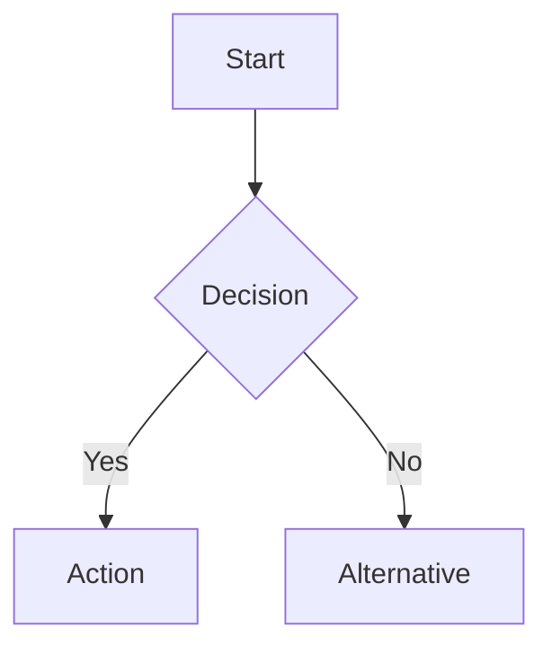
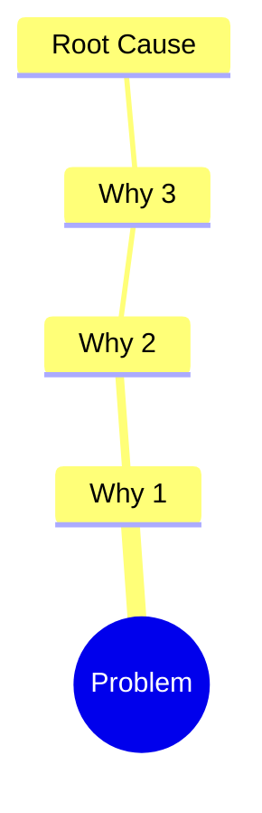

# Document Findings

Takes research output and produces structured, enhanced markdown documentation.

## Inputs

1. **Project path** - `work/{team}/{space}/{project}/`
2. **Source material** - Path to research findings (typically `work/{team}/{space}/{project}/research/`)
3. **Document type** - One of: `research`, `analysis`, `solutions`, `project-overview`

If the project path or source material is missing, ask the user before proceeding.

## Project Folder Structure

All project documentation lives in `work/{team}/{space}/{project}/`:

```
work/{team}/{space}/{project}/
├── README.md              # Project overview (problems listed at top)
├── research/
│   ├── sources.md         # All URLs and sources indexed
│   ├── findings.md        # Extracted content by topic
│   └── link-tree.md       # Visual traversal map
├── analysis/
│   ├── problems.md        # Identified problems + root causes
│   └── current-state.md   # Existing solutions audit
└── solutions/
    └── proposals.md       # New solution proposals
```

## Markdown Standards

### Headings
Use H2 (`##`) as top-level within documents. Reserve H1 (`#`) for the document title only.

### Mermaid Diagrams

Use mermaid for:
- **Flowcharts** - Processes, workflows, decision trees
- **Sequence diagrams** - Multi-step interactions
- **Mind maps** - Problem breakdowns, topic relationships
- **Gantt charts** - Timelines, phases

Example for a workflow:
````markdown

````

Example for root cause:
````markdown

````

### Tables
Use tables for structured comparisons, source indexes, and feature matrices.

### Callouts
Use blockquotes with bold labels for callouts:
```markdown
> **Note:** Additional context here.

> **Warning:** Risk or caveat here.
```

### Links and Sources
Always cite sources inline with markdown links. Group full source lists in tables.

## Process

### 1. Read Source Material
Read all files from the source path. Understand the scope and topics covered.

### 2. Organize by Structure
Map content into the folder structure above based on document type.

### 3. Write Documents
- Start each document with a clear title and one-line summary
- Use mermaid diagrams where relationships or flows exist
- Use tables where comparisons or indexes exist
- Keep paragraphs short (3-4 sentences max)
- Cite sources inline

### 4. Project README
The project `README.md` is the single entry point. Structure:

```markdown
# {Project Name}

## Problems
{Listed at the top, added by strategist workflow}

## Overview
{What this project is about}

## Documents
- [Research Findings](research/findings.md)
- [Source Index](research/sources.md)
- [Problem Analysis](analysis/problems.md)
- [Current State](analysis/current-state.md)
- [Solution Proposals](solutions/proposals.md)
```

## Rules

- Never invent information not present in source material
- Always attribute content to its source
- Use mermaid diagrams for any process with 3+ steps or any hierarchy with 2+ levels
- Keep documents navigable (table of contents for documents exceeding 100 lines)
