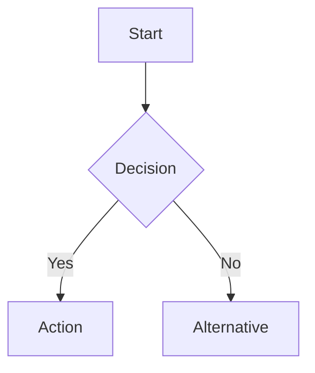
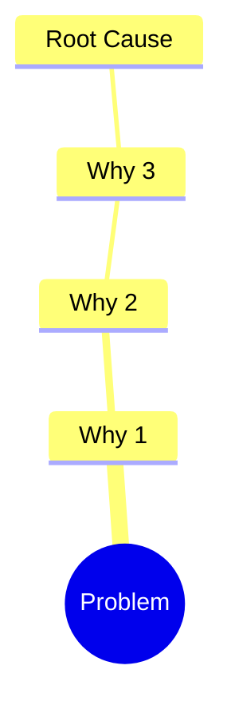

# Document Findings

Takes research output and produces structured, enhanced markdown documentation.

## Inputs

1. **Project path** - `work/{team}/{space}/{project}/`
2. **Source material** - Research output to structure
3. **Document type** - One of: `research`, `analysis`, `solutions`, `project-overview`

If the project path or source material is missing, ask the user before proceeding.

Valid team and space values are defined in `work/config.md`.

## Output

All project documentation lives in a single file: `work/{team}/{space}/{project}/README.md`. Do not create other files (notes, drafts, separate docs) for the project; write everything into this README.

## Markdown Standards

### Headings
Use H2 (`##`) as top-level within documents. Reserve H1 (`#`) for the document title only.

### Mermaid Diagrams

Use mermaid for:
- **Flowcharts** - Processes, workflows, decision trees
- **Sequence diagrams** - Multi-step interactions
- **Mind maps** - Problem breakdowns, topic relationships
- **Gantt charts** - Timelines, phases

Example for a workflow:
````markdown

````

Example for root cause:
````markdown

````

### Tables
Use tables for structured comparisons, source indexes, and feature matrices.

### Callouts
Use blockquotes with bold labels for callouts:
```markdown
> **Note:** Additional context here.

> **Warning:** Risk or caveat here.
```

### Links and Sources
Always cite sources inline with markdown links. Group full source lists in tables.

## Process

### 1. Read Source Material
Read all files from the source path. Understand the scope and topics covered.

### 2. Organize by Sections
Map content into the README sections based on document type.

### 3. Write README
- Start with a clear title and one-line summary
- Use mermaid diagrams where relationships or flows exist
- Use tables where comparisons or indexes exist
- Keep paragraphs short (3-4 sentences max)
- Cite sources inline

### 4. README Structure

```markdown
# {Project Name}

## Table of Contents
- [Problems](#problems)
- [Overview](#overview)
- [Findings](#findings)
- [Sources](#sources)
- [Link Tree](#link-tree)
- [Current State](#current-state)
- [Proposals](#proposals)

## Problems
{Listed at the top, added by Strategist workflow}

## Overview
{What this project is about}

## Findings
{Extracted content organized by topic, sources cited}

## Sources
{URL index with depth, title, parent}

## Link Tree
{Visual traversal map of links followed}

## Current State
{Existing solutions audit}

## Proposals
{New solution proposals}
```

## Rules

- Never use absolute filesystem paths in links. All links must be relative to the document they appear in
- Never invent information not present in source material
- Always attribute content to its source
- Use mermaid diagrams for any process with 3+ steps or any hierarchy with 2+ levels
- Always include a table of contents after the H1 title linking to all H2 sections
